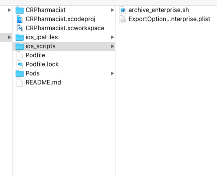

# Learning_Sign_Archive
学习iOS代码签名，ipa文件打包。

### 说明
利用agvtool设置app版本号和编译号；
利用xcodebuild工具归档并导出ipa文件。

### 脚本目录

### 打包脚本代码

详情查看文件`/script/archive.sh`

### 参考链接

* iOS App 签名原理 https://juejin.cn/post/6844903896490459143
* iOS —— 两套自动打包脚本 https://juejin.cn/post/6844903715342663687
* iOS 签名机制 https://juejin.cn/post/6844903744233013262